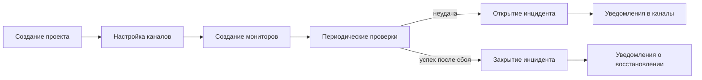
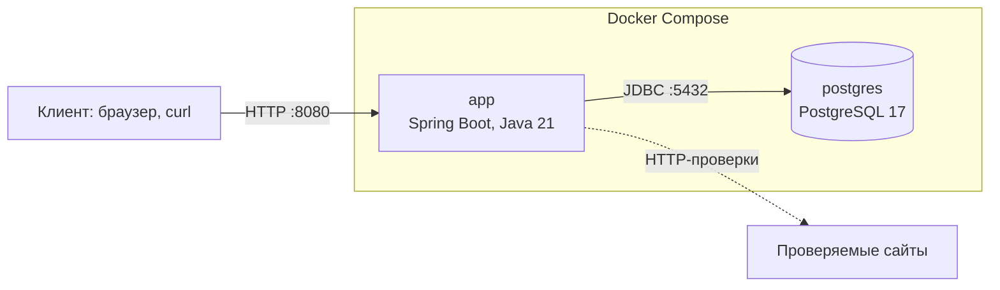
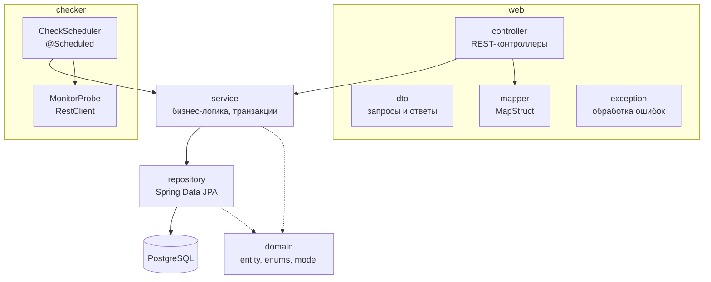
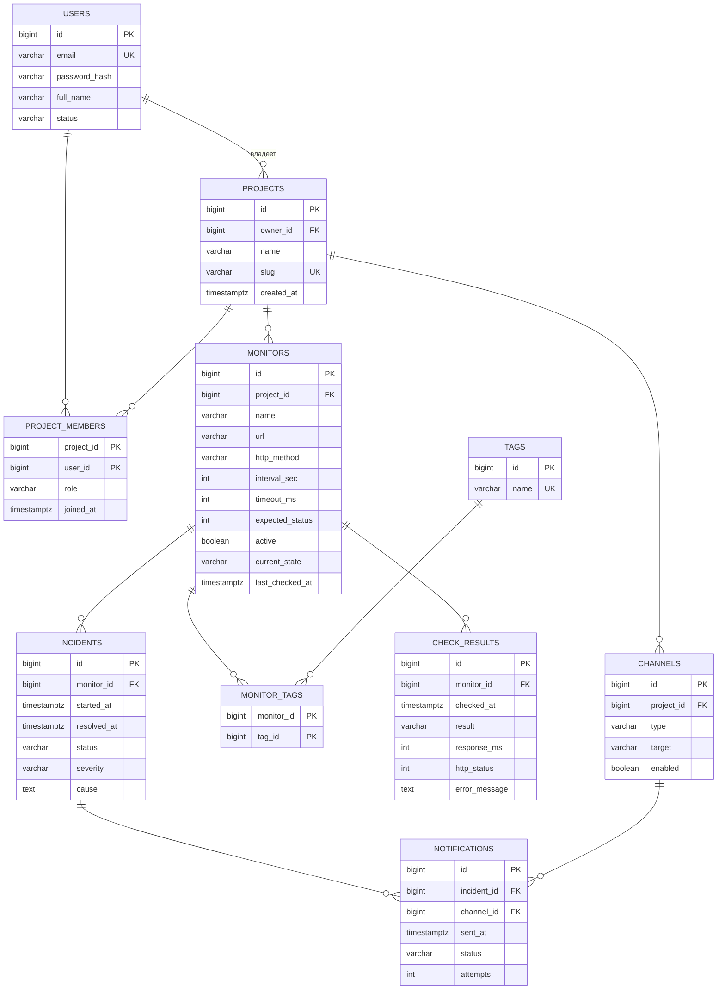
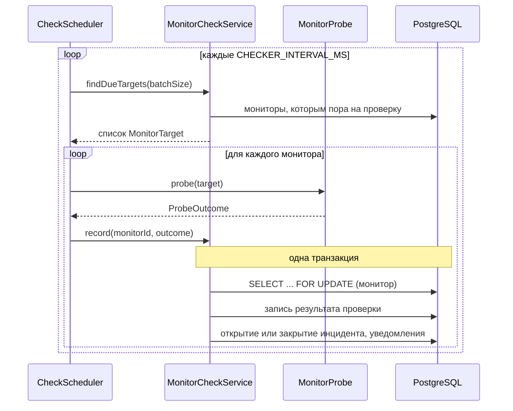
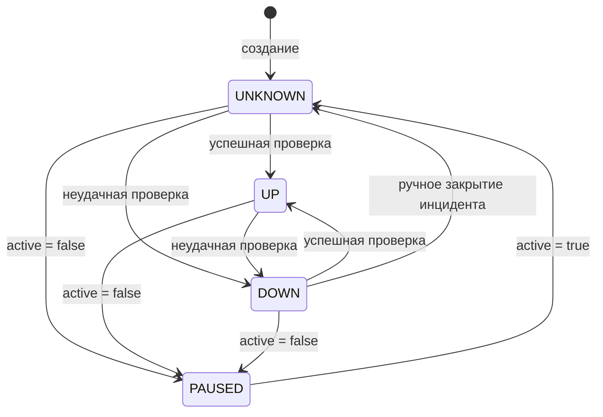

# Лабораторная работа №1. Сервис мониторинга веб-сайтов

**Репозиторий:** https://github.com/awesoma31/service-monitoring
**Версия:** тег `v1.0.1-lab1`

## 1. Задание

Разработать монолитное приложение на Spring Boot с REST API, хранением данных в реляционной
базе, миграциями схемы, пагинацией, транзакциями, валидацией, обработкой ошибок,
интерактивной документацией OpenAPI и покрытием тестами не ниже 70%. Приложение собирается
в Docker и запускается через Docker Compose. Полный текст задания приведён в `TASK.md`,
соответствие требований и реализации — в разделе 11.

## 2. Предметная область

Сервис периодически проверяет доступность веб-сайтов и сообщает о сбоях. Пользователи
объединяются в проекты, в проектах настраивают проверяемые адреса и каналы оповещения.

| Понятие | Описание |
|---|---|
| Пользователь | учётная запись; пароль хранится в виде хеша BCrypt |
| Проект | рабочее пространство с владельцем, участниками, мониторами и каналами |
| Участник | пользователь в проекте с ролью `OWNER`, `EDITOR` или `VIEWER` |
| Монитор | проверяемый адрес: URL, HTTP-метод, интервал, таймаут, ожидаемый код ответа |
| Тег | метка для группировки и фильтрации мониторов |
| Проверка | результат одного HTTP-запроса к монитору |
| Инцидент | период недоступности монитора: от первой неудачной проверки до первой успешной |
| Канал | адрес доставки оповещений проекта: email, webhook или Telegram |
| Уведомление | сообщение о начале или окончании инцидента для одного канала |

Основной сценарий:



## 3. Архитектура

### 3.1. Развёртывание

Система состоит из двух контейнеров, которые поднимаются одной командой
`docker compose up`. Приложение стартует только после того, как база данных пройдёт
проверку готовности.



Параметры подключения к базе и работы планировщика передаются через переменные окружения
(раздел 9).

### 3.2. Структура приложения

Приложение построено по слоистой архитектуре. Базовый пакет — `org.awesoma.monitoring`.



| Пакет | Назначение |
|---|---|
| `web.controller` | приём HTTP-запросов, коды ответов; работает только с DTO |
| `web.dto` | объекты запросов и ответов с аннотациями валидации |
| `web.mapper` | преобразование сущностей в DTO (MapStruct) |
| `web.exception` | единая обработка ошибок в формате RFC 7807 |
| `web.access` | проверка роли вызывающего до вызова контроллера (раздел 7.2) |
| `service` | бизнес-правила и границы транзакций |
| `repository` | доступ к данным, пользовательские запросы, блокировка строк |
| `domain.entity`, `domain.enums` | JPA-сущности и перечисления |
| `domain.model` | `MonitorTarget` и `ProbeOutcome` — типы обмена между `checker` и `service` |
| `checker` | планировщик и выполнение HTTP-проверок |
| `config` | хеширование паролей, OpenAPI, проверка ролей, включение планировщика |

Принятые правила:

- сущности не выходят за пределы сервисного слоя, контроллеры получают и возвращают только DTO;
- маппинг выполняет MapStruct с политикой `unmappedTargetPolicy = ERROR`: неучтённое поле
  приводит к ошибке компиляции;
- пакет `checker` не обращается к базе данных и не использует сущности. В лабораторной работе
  №2 он будет выделен в отдельный сервис без изменения остального кода.

### 3.3. Технологии

| Назначение | Технология |
|---|---|
| Язык и сборка | Java 21, Gradle (Kotlin DSL) |
| Фреймворк | Spring Boot 3.5 (Web, Data JPA, Validation, Actuator) |
| База данных и миграции | PostgreSQL 17, Liquibase |
| Маппинг и шаблонный код | MapStruct, Lombok |
| Документация API | springdoc-openapi, Swagger UI |
| Тестирование | JUnit 5, Mockito, Testcontainers, JaCoCo |
| Развёртывание | Docker, Docker Compose |

## 4. Модель данных

### 4.1. Схема



### 4.2. Связи

| Тип связи | Где | Реализация |
|---|---|---|
| один-ко-многим / многие-к-одному | проект → мониторы и каналы; монитор → проверки и инциденты; инцидент → уведомления | `@ManyToOne(fetch = LAZY)` на стороне внешнего ключа |
| многие-ко-многим | мониторы ↔ теги (`monitor_tags`) | `@ManyToMany` с `@JoinTable`; таблица связи содержит только два ключа |
| многие-ко-многим с дополнительными полями | проекты ↔ пользователи (`project_members`: `role`, `joined_at`) | отдельная сущность `ProjectMember` с составным ключом `ProjectMemberId` |

Перечисления хранятся строками (`@Enumerated(EnumType.STRING)`), допустимые значения
дополнительно ограничены `CHECK` в базе.

| Перечисление | Значения |
|---|---|
| `MonitorState` | `UP`, `DOWN`, `PAUSED`, `UNKNOWN` |
| `CheckResultType` | `SUCCESS`, `TIMEOUT`, `BAD_STATUS`, `CONNECTION_ERROR` |
| `IncidentStatus` | `OPEN`, `RESOLVED` |
| `Severity` | `LOW`, `MEDIUM`, `HIGH`, `CRITICAL` |
| `NotificationStatus` | `PENDING`, `SENT`, `FAILED` |
| `MemberRole` | `OWNER`, `EDITOR`, `VIEWER` |
| `ChannelType` | `EMAIL`, `WEBHOOK`, `TELEGRAM` |
| `UserStatus` | `ACTIVE`, `INACTIVE`, `BLOCKED` |
| `HttpMethod` | `GET`, `HEAD`, `POST`, `PUT`, `PATCH`, `DELETE` |

### 4.3. Ограничения целостности

Правила, которые можно выразить средствами базы данных, закреплены в схеме:

- не более одного открытого инцидента на монитор — частичный уникальный индекс
  `UNIQUE (monitor_id) WHERE status = 'OPEN'`;
- инцидент в статусе `RESOLVED` обязан иметь время закрытия, в статусе `OPEN` — не иметь;
  время закрытия не раньше времени начала;
- уведомление в статусе `SENT` обязано иметь время отправки;
- диапазоны интервала (10–86400 с), таймаута (100–60000 мс) и кода ответа (100–599);
- уникальность email, slug проекта, имени тега, пары «тип + адрес» канала в проекте.

Индексы: `check_results (monitor_id, checked_at DESC)` для выборки истории проверок,
`incidents (monitor_id, status)` для поиска открытого инцидента.

При удалении проекта или монитора зависимые записи удаляются каскадно на уровне базы.
Внешний ключ на владельца проекта каскада не имеет: пользователя, владеющего проектом,
удалить нельзя.

### 4.4. Миграции

Схема создаётся только миграциями Liquibase: 13 наборов изменений (changeset) в формате
YAML, у каждого описан откат. Применённые наборы не редактируются; изменения схемы
добавляются новыми наборами. Hibernate работает в режиме `ddl-auto: validate` и при
старте проверяет соответствие сущностей схеме.

## 5. Проверка мониторов

### 5.1. Цикл планировщика

Планировщик реализован на `@Scheduled` с фиксированной задержкой между проходами и
`RestClient` для HTTP-запросов, без сторонних библиотек и собственных пулов потоков.



1. **Выбор мониторов.** Проверяются активные мониторы, которые ещё не проверялись или с
   момента последней проверки которых прошло не меньше их интервала. Сначала выбираются
   давно проверенные, не более `CHECKER_BATCH_SIZE` за проход.
2. **Проверка.** Выполняется HTTP-запрос с таймаутом конкретного монитора. Совпадение кода
   ответа с ожидаемым даёт `SUCCESS`, несовпадение — `BAD_STATUS`, истечение таймаута —
   `TIMEOUT`, прочие сетевые ошибки — `CONNECTION_ERROR`.
3. **Запись результата** выполняется в одной транзакции (раздел 6). Сетевой запрос
   выполняется до начала транзакции, поэтому блокировка удерживается только на время записи.
4. Ошибка при обработке одного монитора записывается в журнал и не прерывает обработку
   остальных.

### 5.2. Состояния монитора



Инцидент открывается при переходе в `DOWN`, если открытого инцидента ещё нет, и
закрывается при переходе из `DOWN` в `UP`. Повторные неудачные проверки монитора в `DOWN`
новых инцидентов не создают.

Приостановка монитора не закрывает инцидент: прекращение проверок не означает
восстановления сайта. После возобновления первая проверка определяет судьбу инцидента:
неудачная продолжает его, успешная закрывает.

Ручное закрытие инцидента через API переводит монитор в `UNKNOWN`, а не в `UP`: состояние
сайта установит следующая проверка.

### 5.3. Инциденты и уведомления

Серьёзность инцидента определяется причиной сбоя: недоступность хоста и таймаут — `HIGH`,
неверный код ответа — `MEDIUM`.

При открытии и при закрытии инцидента для каждого включённого канала проекта создаётся
уведомление в статусе `PENDING`. Фактическая доставка по каналам в рамках лабораторной
работы №1 не реализуется; она запланирована в лабораторной работе №4 с использованием
брокера сообщений.

## 6. Транзакции

| Операция | Действия | Обоснование |
|---|---|---|
| Открытие инцидента (`MonitorCheckService.record`, неудачная проверка) | запись результата, перевод монитора в `DOWN`, создание инцидента, создание уведомлений по всем включённым каналам | частичное выполнение оставило бы монитор в `DOWN` без инцидента или инцидент без уведомлений; следующие проверки такое состояние не исправят |
| Закрытие инцидента (`MonitorCheckService.record`, успешная проверка) | запись результата, закрытие инцидента, перевод монитора в `UP`, создание уведомлений о восстановлении | то же требование атомарности; дополнительно защита от параллельной обработки одного монитора |
| Создание проекта (`ProjectService.create`) | создание проекта, добавление владельца в `project_members` с ролью `OWNER` | проект без владельца в списке участников невозможно администрировать, и через API это не исправить |

Обе операции с инцидентами выполняются в одном методе и начинаются с блокировки строки
монитора (`@Lock(PESSIMISTIC_WRITE)`, в SQL — `SELECT ... FOR UPDATE`). Без блокировки два
параллельных обработчика прочитали бы одинаковое состояние монитора и оба попытались бы
открыть инцидент. С блокировкой второй обработчик ожидает завершения первого и видит уже
обновлённое состояние. Частичный уникальный индекс на открытые инциденты исключает дубликат
на уровне базы данных.

Пессимистическая блокировка выбрана вместо оптимистической, так как конфликт при
параллельных проверках ожидаем, а блокировка удерживается недолго.

Остальные изменяющие методы сервисов также выполняются в транзакциях, читающие — в
транзакциях только для чтения. Режим `open-in-view` отключён.

## 7. REST API

Все ресурсы доступны по префиксу `/api/v1`. Документация: Swagger UI по адресу
`/swagger-ui.html`, спецификация OpenAPI — `/v3/api-docs`.

| Ресурс | Операции |
|---|---|
| Пользователи | `GET, POST /users`; `GET, PUT, DELETE /users/{id}` |
| Проекты | `GET, POST /projects`; `GET, PUT, DELETE /projects/{id}` |
| Участники | `GET, POST /projects/{id}/members`; `PUT, DELETE /projects/{id}/members/{userId}` |
| Мониторы | `GET, POST /projects/{id}/monitors`; `GET, PUT, DELETE /monitors/{id}`; `PUT /monitors/{id}/tags` |
| История проверок | `GET /monitors/{id}/results` |
| Инциденты | `GET /monitors/{id}/incidents`; `GET /incidents/{id}`; `POST /incidents/{id}/resolve`; `GET /incidents/{id}/notifications` |
| Каналы | `GET, POST /projects/{id}/channels`; `GET, PUT, DELETE /channels/{id}` |
| Теги | `GET, POST /tags`; `DELETE /tags/{id}` |

Всего 33 операции. Коды ответов:

| Код | Когда |
|---|---|
| `200` | успешное чтение или изменение |
| `201` + `Location` | создание ресурса |
| `204` | удаление |
| `400` | некорректный запрос: ошибки валидации, неверный JSON, неизвестное значение перечисления |
| `401` | не передан заголовок роли или передана неизвестная роль |
| `403` | роли запрещена операция |
| `404` | ресурс не найден |
| `409` | конфликт с текущим состоянием: занятый email или slug, повторное закрытие инцидента, удаление последнего владельца проекта |

### 7.1. Пагинация

Все списки постраничные. Параметры `page` (от 0) и `size` (от 1 до 50, по умолчанию 20)
общие для всех эндпоинтов. Запрос с `size` больше 50 отклоняется с кодом 400.

| | `Page` | `Slice` |
|---|---|---|
| Где | мониторы проекта и остальные списки | история проверок `/monitors/{id}/results` |
| Запросы к БД | страница и `count(*)` | только страница: запрашивается на одну строку больше, чтобы узнать, есть ли продолжение |
| Общее количество | в теле ответа и в заголовке `X-Total-Count` | отсутствует |
| Назначение | интерфейс с номерами страниц | бесконечная прокрутка |

История проверок — самая быстрорастущая таблица: при интервале 10 секунд монитор
добавляет более 8000 записей в сутки. Подсчёт строк при каждой подгрузке обходился бы
дороже самой страницы, а для прокрутки достаточно знать, есть ли следующая.

Теги мониторов на странице загружаются одним дополнительным запросом для всей страницы
(`@BatchSize`), а не отдельным запросом на каждый монитор. Число запросов в обоих случаях
контролируется тестами, которые подсчитывают SQL-запросы.

### 7.2. Разграничение доступа

Каждый запрос к API передаёт роль вызывающего в заголовке `X-User-Role`: `OWNER`, `EDITOR`
или `VIEWER`. Допустимые роли указаны на методах и классах контроллеров аннотацией
`@AllowedRoles`. Перехватчик `RoleAuthorizationInterceptor` проверяет заголовок до вызова
контроллера: при отсутствии заголовка или неизвестной роли возвращается `401`, при
недопустимой роли — `403`.

| Операции | Роли |
|---|---|
| чтение любых ресурсов | `OWNER`, `EDITOR`, `VIEWER` |
| изменение мониторов, тегов и каналов; ручное закрытие инцидента; переименование проекта | `OWNER`, `EDITOR` |
| управление пользователями; создание и удаление проекта; управление участниками | `OWNER` |

В спецификации OpenAPI заголовок описан для каждой операции со списком допустимых ролей,
поэтому запросы из Swagger UI выполняются с выбранной ролью.

Роль в заголовке не сверяется с участием пользователя в проекте: механизм разграничивает
операции, но не подтверждает личность. Аутентификация будет добавлена в лабораторной
работе №3.

## 8. Валидация и обработка ошибок

Валидация выполняется на трёх уровнях:

1. **DTO** — аннотации Bean Validation (`@NotBlank`, `@Email`, `@Size`, `@Min`, `@Max`,
   `@Pattern`, `@Positive`). Ошибка возвращается клиенту с указанием поля.
2. **Сущности** — те же ограничения на полях сущностей; проверяются перед записью.
3. **База данных** — `NOT NULL`, `CHECK`, `UNIQUE`, внешние ключи.

Все ошибки возвращаются в формате RFC 7807 (`application/problem+json`) через
`@RestControllerAdvice`. Технические подробности (имена ограничений, исключения парсера)
в ответ не включаются.

```json
{
  "title": "Request validation failed",
  "status": 400,
  "detail": "One or more request values are invalid",
  "instance": "/api/v1/projects/1/monitors",
  "violations": [
    { "field": "url", "message": "must be an http or https URL" },
    { "field": "intervalSec", "message": "must be greater than or equal to 10" }
  ]
}
```

## 9. Конфигурация и запуск

Конфигурация задаётся только переменными окружения.

| Переменная | По умолчанию | Назначение |
|---|---|---|
| `DB_URL`, `DB_USER`, `DB_PASSWORD` | — | подключение к базе данных |
| `APP_PORT` | `8080` | порт приложения |
| `CHECKER_ENABLED` | `true` | включение планировщика |
| `CHECKER_INTERVAL_MS` | `15000` | пауза между проходами планировщика |
| `CHECKER_BATCH_SIZE` | `50` | число мониторов за проход |

В `docker-compose.yml` параметры базы данных собираются из `POSTGRES_DB`, `POSTGRES_USER`,
`POSTGRES_PASSWORD` (файл `.env`, образец — `.env.example`).

Все запросы к `/api/v1` должны содержать заголовок роли (раздел 7.2),
например `X-User-Role: OWNER`.

Запуск и проверка:

```bash
cp .env.example .env
docker compose up --build        # PostgreSQL и приложение
./scripts/demo.sh                # сквозной сценарий по API
./gradlew check                  # тесты и контроль покрытия
```

Скрипт `scripts/demo.sh` последовательно выполняет основной сценарий с ролью `OWNER`:
создание пользователя и проекта, конфликтные и некорректные запросы, обе формы пагинации,
полный цикл инцидента от падения монитора до автоматического закрытия, а также запросы без
роли (`401`) и с недостаточной ролью (`403`).

## 10. Тестирование

| Уровень | Что проверяется |
|---|---|
| Модульные тесты (Mockito) | бизнес-правила сервисов, логика инцидентов, планировщик |
| Тесты доменной модели | согласованность статусов и времени, равенство сущностей |
| Тесты веб-слоя (`@WebMvcTest`) | формат ошибок и коды ответов, проверка ролей (`401`, `403`, допустимые операции для каждой роли) |
| HTTP-проверка | результаты проверок на реальном HTTP-сервере: успех, неверный код, таймаут, отказ соединения |
| Интеграционные тесты (Testcontainers) | REST API на реальной базе, миграции и их откат, маппинг сущностей, полный цикл инцидента, число SQL-запросов при пагинации |

Интеграционные тесты используют один контейнер PostgreSQL на весь прогон. Каждый тест
выполняется в транзакции, которая откатывается по завершении. Тест миграций работает с
отдельной базой в том же контейнере, так как откатывает всю схему.

Задача `./gradlew check` запускает тесты и завершается ошибкой при покрытии строк ниже 70%
(JaCoCo). Текущие показатели: 121 тест, покрытие строк 97,3%, ветвлений 86,7%.

## 11. Соответствие требованиям

| Требование | Реализация |
|---|---|
| Spring Boot, Java, Gradle | Spring Boot 3.5, Java 21, Gradle Kotlin DSL; версии зависимостей через Spring BOM |
| CRUD через REST API, корректные HTTP-статусы | раздел 7; `web/controller` |
| Spring Data JPA | `repository` |
| Валидация на уровне контроллера и сущности | раздел 8; `web/dto`, `domain/entity`, ограничения в миграциях |
| Схема БД через миграции | Liquibase, `src/main/resources/db/changelog` |
| Интеграционные тесты с Testcontainers | раздел 10; `src/test/java/.../web`, `checker`, `db` |
| Покрытие тестами не ниже 70% | JaCoCo в задаче `check`; фактически 97,3% |
| Конфигурация через переменные окружения | раздел 9; `application.yml`, `docker-compose.yml` |
| Сборка в Docker, запуск через Docker Compose | `Dockerfile`, `docker-compose.yml` |
| База данных в Docker | PostgreSQL 17 в `docker-compose.yml` |
| Пагинация всех списков, не более 50 записей | `PageParams`, раздел 7.1 |
| Список без общего количества (бесконечная прокрутка) | `GET /monitors/{id}/results`, `Slice` |
| Список с общим количеством в заголовке | `GET /projects/{id}/monitors`, `X-Total-Count` |
| Не менее двух транзакций с обоснованием | раздел 6: три транзакции |
| Разделение Entity и DTO | `domain/entity`, `web/dto`, MapStruct |
| Разделение на слои | раздел 3.2 |
| Перечисления в БД строками | `@Enumerated(EnumType.STRING)`, раздел 4.2 |
| Обработка ошибок с понятным сообщением | `GlobalExceptionHandler`, раздел 8 |
| Связи всех трёх типов | раздел 4.2 |
| OpenAPI 3 и Swagger UI | springdoc, `/swagger-ui.html` |
| Feature branching и conventional commits | история репозитория |
