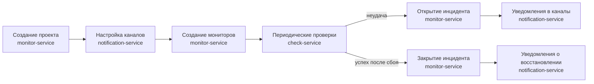
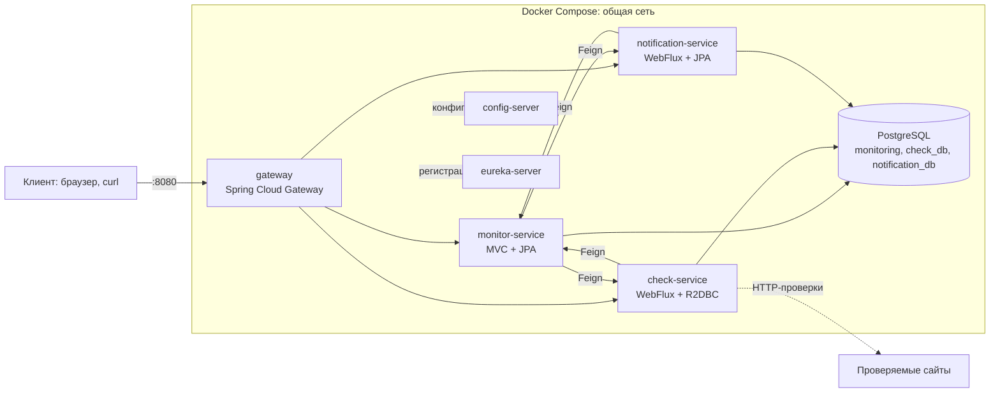
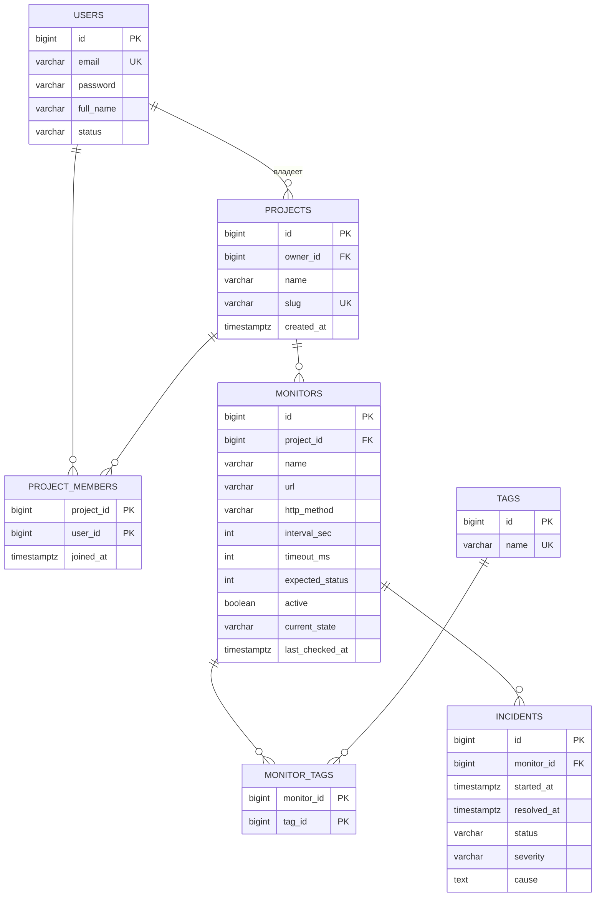
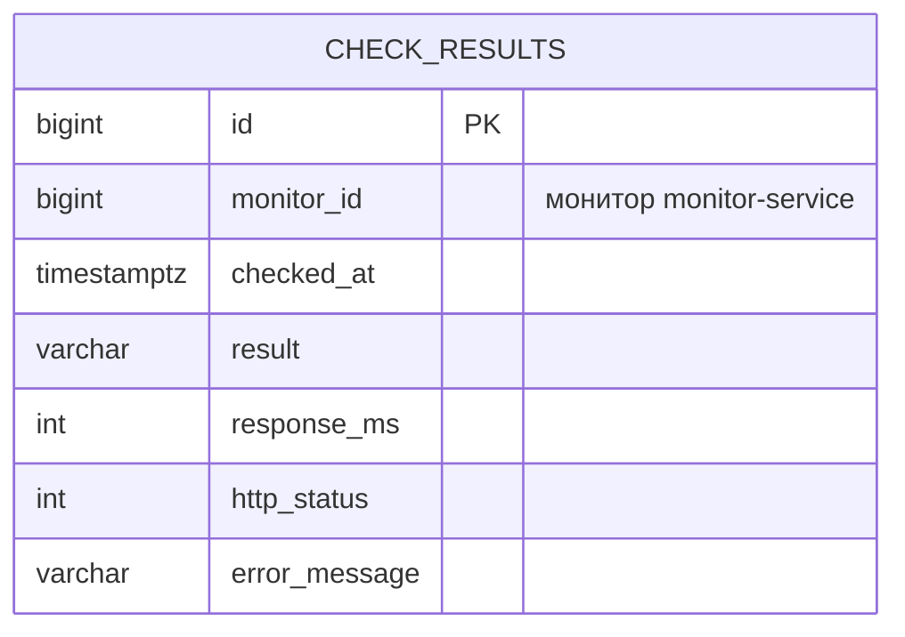
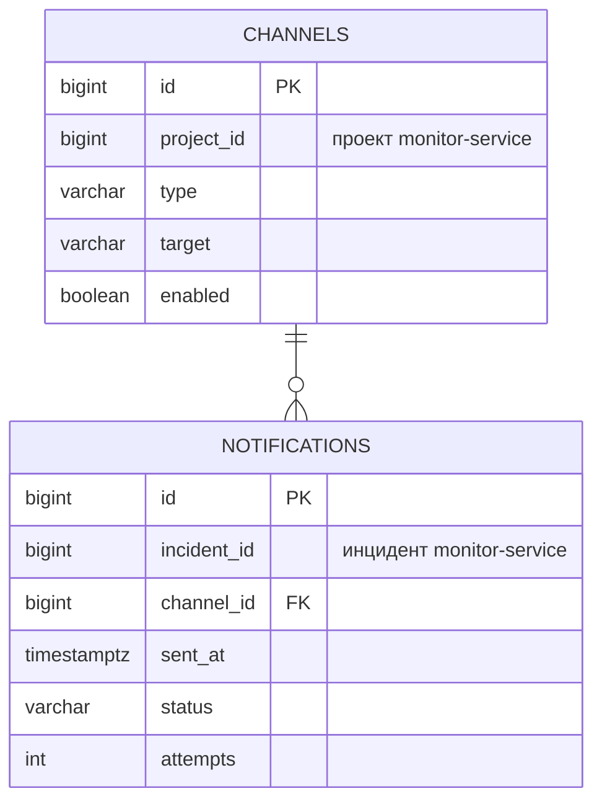
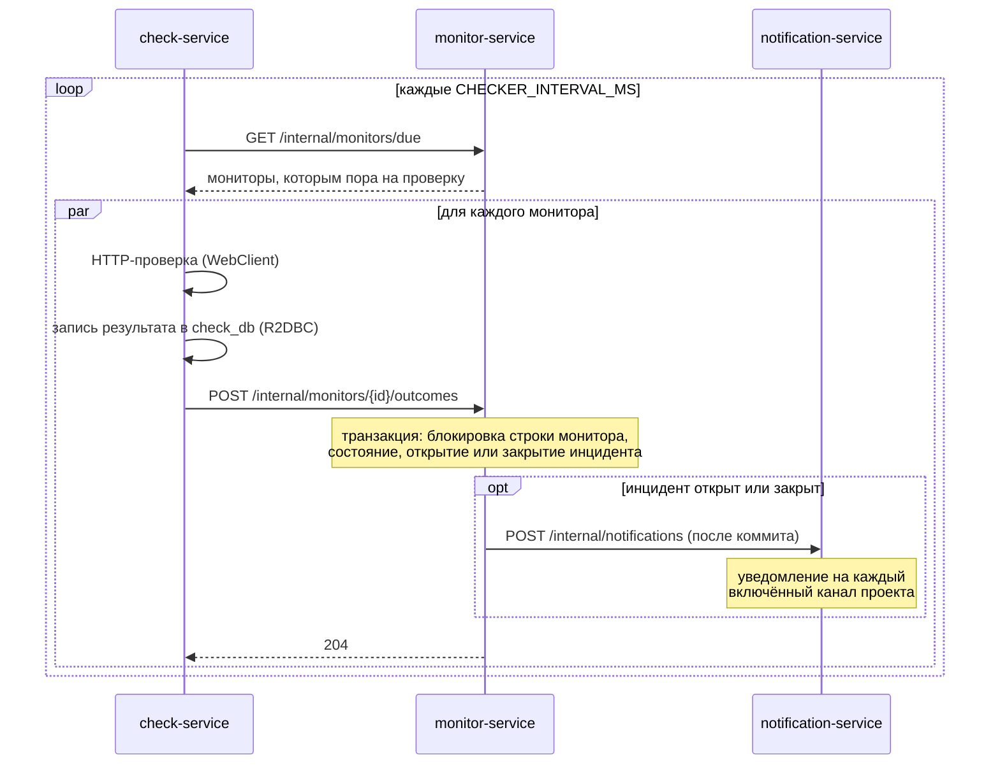
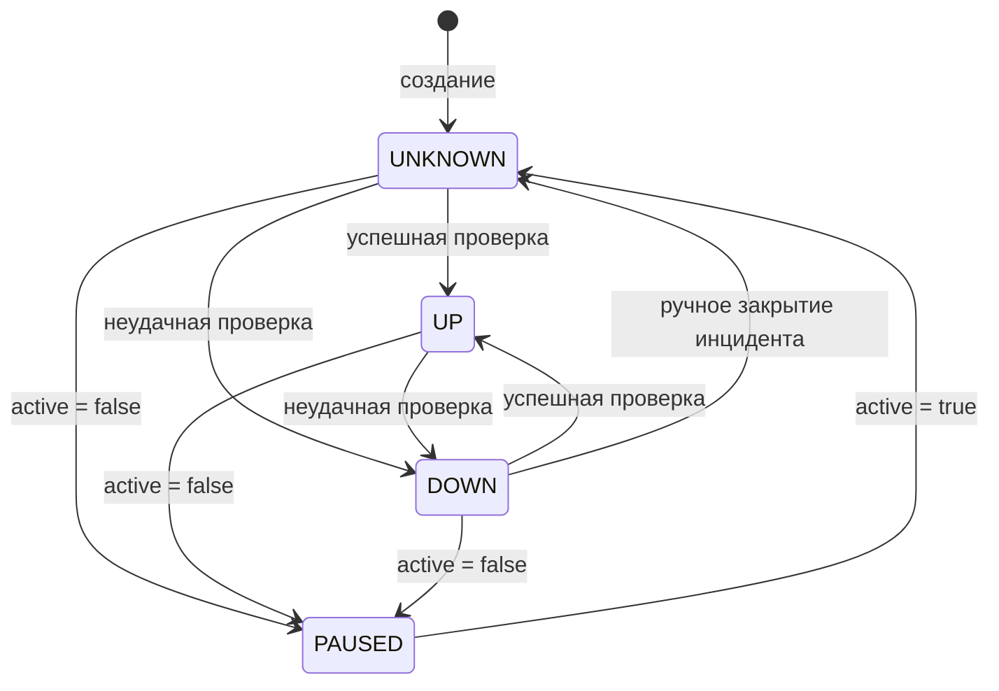
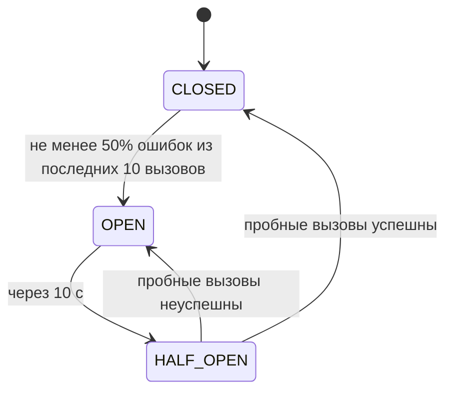

# Лабораторная работа №2. Сервис мониторинга веб-сайтов: микросервисная архитектура

**Репозиторий:** https://github.com/awesoma31/service-monitoring
**Версия:** тег `v2.0.0-lab2`

## 1. Задание

Разбить монолитное приложение из лабораторной работы №1 на микросервисы:

- микросервисы регистрируются в Eureka;
- микросервисы получают конфигурацию из Config Server;
- микросервисы доступны через Spring Cloud Gateway;
- межсервисное взаимодействие выполняется через Feign Client;
- внедрён Circuit Breaker;
- минимум один микросервис написан с использованием Reactor и R2DBC;
- минимум один микросервис написан с использованием Reactor и Spring Data JPA/JDBC.

Требования лабораторной работы №1 (REST API, миграции, пагинация, транзакции, валидация,
тесты, запуск через Docker Compose, общий Swagger) сохраняются. Соответствие требований и
реализации — в разделе 14.

## 2. Предметная область

Сервис периодически проверяет доступность веб-сайтов и сообщает о сбоях. Пользователи
объединяются в проекты, в проектах настраивают проверяемые адреса и каналы оповещения.
Каждое понятие принадлежит одному сервису.

| Понятие | Описание | Сервис |
|---|---|---|
| Пользователь | учётная запись | monitor-service |
| Проект | рабочее пространство с владельцем, участниками, мониторами и каналами | monitor-service |
| Участник | пользователь, добавленный в проект; хранится дата вступления | monitor-service |
| Монитор | проверяемый адрес: URL, HTTP-метод, интервал, таймаут, ожидаемый код ответа | monitor-service |
| Тег | метка для группировки и фильтрации мониторов | monitor-service |
| Инцидент | период недоступности монитора: от первой неудачной проверки до первой успешной | monitor-service |
| Проверка | результат одного HTTP-запроса к монитору | check-service |
| Канал | адрес доставки оповещений проекта: email, webhook или Telegram | notification-service |
| Уведомление | сообщение о начале или окончании инцидента для одного канала | notification-service |

Основной сценарий и сервисы, которые в нём участвуют:



## 3. Архитектура

### 3.1. Развёртывание

Система состоит из восьми контейнеров, которые поднимаются одной командой
`docker compose up` в общей docker-сети. Контейнеры обращаются друг к другу по именам
сервисов; бизнес-сервисы находят друг друга через Eureka.



| Контейнер | Назначение | Доступ с хоста |
|---|---|---|
| `postgres` | PostgreSQL 17, базы всех сервисов | `:5432` (для отладки) |
| `postgres-init` | создание баз `check_db` и `notification_db`, завершается после выполнения | — |
| `config-server` | конфигурация сервисов | — |
| `eureka-server` | реестр сервисов | `:8761` (панель) |
| `monitor-service`, `check-service`, `notification-service` | бизнес-сервисы | — |
| `gateway` | точка входа в API, общий Swagger UI | `:8080` |

Порядок запуска задан проверками готовности (`depends_on` с `service_healthy`):
PostgreSQL → создание баз → config-server → eureka-server → бизнес-сервисы → gateway.

### 3.2. Сервисы

| Сервис | Стек | Ответственность |
|---|---|---|
| monitor-service | Spring MVC, Spring Data JPA | пользователи, проекты, участники, мониторы, теги, инциденты |
| check-service | Spring WebFlux, Spring Data R2DBC | планировщик, HTTP-проверки, история проверок |
| notification-service | Spring WebFlux, Spring Data JPA | каналы оповещения, уведомления |
| config-server | Spring Cloud Config | конфигурация сервисов |
| eureka-server | Spring Cloud Netflix Eureka | реестр сервисов |
| gateway | Spring Cloud Gateway | маршрутизация, общий Swagger UI, Circuit Breaker |

Все модули — подпроекты одной Gradle-сборки. Бизнес-сервисы сохраняют слоистую
структуру лабораторной работы №1:

| Пакет | Назначение |
|---|---|
| `web` | контроллеры, DTO, обработка ошибок; наружу — только DTO |
| `service` | бизнес-правила и границы транзакций |
| `repository` | доступ к данным |
| `domain` | сущности и перечисления |
| `client` | Feign-клиенты других сервисов и их fallback (check-service, notification-service) |
| `integration` | события после коммита, Feign-клиенты и их fallback (monitor-service) |
| `probe`, `scheduling` | HTTP-проверка и планировщик (check-service) |
| `support` | выполнение JPA в реактивном сервисе (notification-service) |
| `config` | OpenAPI, Feign |

Сервисы не зависят друг от друга на уровне сборки: типы, которыми они обмениваются
(`MonitorTarget`, `ProbeOutcome`, событие инцидента), описаны в каждом сервисе отдельно и
связаны только форматом JSON.

### 3.3. Технологии

| Назначение | Технология |
|---|---|
| Язык и сборка | Java 21, Gradle (Kotlin DSL), многомодульная сборка |
| Фреймворк | Spring Boot 3.5, Spring Cloud 2025.0 |
| Веб-слой | Spring MVC (monitor-service), Spring WebFlux (check-service, notification-service, gateway) |
| Доступ к данным | Spring Data JPA, Spring Data R2DBC |
| База данных и миграции | PostgreSQL 17, Liquibase |
| Инфраструктура | Spring Cloud Config, Netflix Eureka, Spring Cloud Gateway, Spring Cloud LoadBalancer |
| Межсервисные вызовы | Spring Cloud OpenFeign |
| Отказоустойчивость | Resilience4j (Spring Cloud CircuitBreaker) |
| Маппинг и шаблонный код | MapStruct, Lombok |
| Документация API | springdoc-openapi, Swagger UI |
| Тестирование | JUnit 5, Mockito, Reactor Test, Testcontainers, JaCoCo |
| Развёртывание | Docker (BuildKit), Docker Compose |

## 4. Модель данных

### 4.1. Разделение данных

У каждого бизнес-сервиса своя база данных в общем контейнере PostgreSQL и свои миграции.
Сервис работает только со своей базой. Ссылки на сущности другого сервиса хранятся как
идентификаторы без внешних ключей; на диаграммах ниже они подписаны.

**monitor-service — база `monitoring`:**



**check-service — база `check_db`:**



**notification-service — база `notification_db`:**



Согласованность ссылок между сервисами поддерживается вызовами: при удалении монитора или
проекта monitor-service просит check-service удалить историю проверок, а
notification-service — каналы проекта (раздел 5.3).

### 4.2. Связи

| Тип связи | Где | Реализация |
|---|---|---|
| один-ко-многим / многие-к-одному | проект → мониторы; монитор → инциденты; канал → уведомления | `@ManyToOne(fetch = LAZY)` на стороне внешнего ключа |
| многие-ко-многим | мониторы ↔ теги (`monitor_tags`) | `@ManyToMany` с `@JoinTable`; таблица связи содержит только два ключа |
| многие-ко-многим с дополнительным полем | проекты ↔ пользователи (`project_members`: `joined_at`) | отдельная сущность `ProjectMember` с составным ключом `ProjectMemberId` |

Перечисления хранятся строками (`@Enumerated(EnumType.STRING)` в JPA, строковое
представление в R2DBC), допустимые значения дополнительно ограничены `CHECK` в базе.

| Перечисление | Значения | Сервис |
|---|---|---|
| `MonitorState` | `UP`, `DOWN`, `PAUSED`, `UNKNOWN` | monitor-service |
| `IncidentStatus` | `OPEN`, `RESOLVED` | monitor-service |
| `Severity` | `LOW`, `MEDIUM`, `HIGH`, `CRITICAL` | monitor-service |
| `UserStatus` | `ACTIVE`, `INACTIVE`, `BLOCKED` | monitor-service |
| `HttpMethod` | `GET`, `HEAD`, `POST`, `PUT`, `PATCH`, `DELETE` | monitor-service, check-service |
| `CheckResultType` | `SUCCESS`, `TIMEOUT`, `BAD_STATUS`, `CONNECTION_ERROR` | monitor-service, check-service |
| `ChannelType` | `EMAIL`, `WEBHOOK`, `TELEGRAM` | notification-service |
| `NotificationStatus` | `PENDING`, `SENT`, `FAILED` | notification-service |

### 4.3. Ограничения целостности

- не более одного открытого инцидента на монитор — частичный уникальный индекс
  `UNIQUE (monitor_id) WHERE status = 'OPEN'`;
- инцидент в статусе `RESOLVED` обязан иметь время закрытия, в статусе `OPEN` — не иметь;
- уведомление в статусе `SENT` обязано иметь время отправки;
- диапазоны интервала (10–86400 с), таймаута (100–60000 мс) и кода ответа (100–599);
- уникальность email, slug проекта, имени тега, пары «тип + адрес» канала в проекте.

Индексы: `check_results (monitor_id, checked_at DESC)` — выборка истории проверок;
`incidents (monitor_id, status)` — поиск открытого инцидента;
`notifications (incident_id)` — уведомления инцидента.

### 4.4. Миграции

Схема каждой базы создаётся только миграциями Liquibase своего сервиса; у каждого набора
изменений описан откат, применённые наборы не редактируются.

| Сервис | Наборы изменений |
|---|---|
| monitor-service | 17: 001–015 из лабораторной работы №1; 016 удаляет `check_results`, 017 — `channels` и `notifications`, перенесённые в другие сервисы. Откаты 016 и 017 восстанавливают таблицы пустыми |
| check-service | 1: `check_results` с ограничениями и индексом |
| notification-service | 2: `channels`, `notifications` |

check-service работает с базой через R2DBC, а Liquibase требует JDBC, поэтому миграции
выполняются по отдельному JDBC-подключению до начала работы сервиса.

## 5. Взаимодействие сервисов

### 5.1. Внутренний API

Сервисы вызывают друг друга через Feign Client по имени сервиса; адрес экземпляра
определяется через Eureka и Spring Cloud LoadBalancer. Внутренние эндпоинты
(`/internal/**`) gateway не маршрутизирует, и в документации они скрыты.

| Кто → кому | Вызов | Назначение |
|---|---|---|
| check-service → monitor-service | `GET /internal/monitors/due` | мониторы, которым пора на проверку |
| check-service → monitor-service | `POST /internal/monitors/{id}/outcomes` | результат проверки |
| check-service → monitor-service | `GET /internal/monitors/{id}/exists` | проверка монитора для запроса истории |
| notification-service → monitor-service | `GET /internal/projects/{id}/exists`, `GET /internal/incidents/{id}/exists` | проверка проекта и инцидента |
| monitor-service → notification-service | `POST /internal/notifications` | инцидент открыт или закрыт |
| monitor-service → notification-service | `DELETE /internal/projects/{id}/channels` | проект удалён |
| monitor-service → check-service | `DELETE /internal/results?monitor_id=` | монитор удалён |

### 5.2. Цикл проверки



1. **Выбор мониторов.** check-service запрашивает у monitor-service активные мониторы,
   которые ещё не проверялись или с момента последней проверки которых прошло не меньше их
   интервала, — не более `CHECKER_BATCH_SIZE` за проход.
2. **Проверка.** Мониторы проверяются параллельно (не более `CHECKER_CONCURRENCY`
   одновременно) через `WebClient`; таймаут монитора ограничивает весь обмен, включая
   установку соединения. Совпадение кода ответа с ожидаемым даёт `SUCCESS`,
   несовпадение — `BAD_STATUS`, истечение таймаута — `TIMEOUT`, прочие ошибки —
   `CONNECTION_ERROR`.
3. **Запись и сообщение.** Результат сначала записывается в историю check-service, затем
   сообщается monitor-service. Если monitor-service недоступен, история остаётся полной, а
   состояние монитора обновит следующая проверка.
4. **Применение результата.** monitor-service в одной транзакции блокирует строку монитора,
   обновляет его состояние и открывает или закрывает инцидент (раздел 9).

### 5.3. События после коммита

monitor-service не вызывает другие сервисы внутри транзакции. Изменения публикуются как
события приложения, а слушатель `@TransactionalEventListener` обрабатывает их только после
успешного коммита.

| Событие | Когда | Вызов |
|---|---|---|
| `IncidentChanged` | инцидент открыт или закрыт | notification-service: уведомления |
| `MonitorDeleted` | монитор удалён | check-service: удаление истории |
| `ProjectDeleted` | проект удалён | check-service: история всех мониторов проекта; notification-service: каналы проекта |

Откатившаяся транзакция не порождает уведомлений, а недоступность другого сервиса не
отменяет уже совершённое изменение.

### 5.4. Состояния монитора



Инцидент открывается при переходе в `DOWN`, если открытого инцидента ещё нет, и
закрывается первой успешной проверкой. Приостановка монитора не закрывает инцидент: после
возобновления первая проверка продолжает его или закрывает. Серьёзность инцидента:
недоступность хоста и таймаут — `HIGH`, неверный код ответа — `MEDIUM`.

## 6. Инфраструктура

### 6.1. Eureka

Каждый сервис и gateway регистрируются в Eureka под своим именем приложения. Gateway
маршрутизирует по адресам вида `lb://monitor-service`, Feign-клиенты — по имени сервиса;
конкретный экземпляр выбирает Spring Cloud LoadBalancer. Интервалы обновления реестра и
кэша балансировщика уменьшены до 5 секунд, чтобы запущенный сервис становился доступен
через несколько секунд после старта.

### 6.2. Config Server

Config Server работает с профилем `native` и отдаёт файлы каталога `config-repo` модуля
config-server:

| Файл | Содержимое |
|---|---|
| `application.yml` | общее для всех: именование полей JSON (snake_case), Eureka, Circuit Breaker, actuator, учёт заголовков `X-Forwarded-*` |
| `monitor-service.yml` | подключение к базе, JPA, Liquibase |
| `check-service.yml` | R2DBC, Liquibase по JDBC, параметры планировщика |
| `notification-service.yml` | подключение к базе, JPA, Liquibase |
| `gateway.yml` | маршруты, Circuit Breaker маршрутов, общий Swagger UI |

Сервис хранит у себя только имя и адрес Config Server (`spring.config.import`); значения
секретов передаются переменными окружения. Тесты подключают те же файлы напрямую, поэтому
проверяют ту же конфигурацию, что используется при запуске.

### 6.3. Gateway

| Путь | Сервис |
|---|---|
| `/api/v1/monitors/*/results` | check-service |
| `/api/v1/projects/*/channels`, `/api/v1/channels/**`, `/api/v1/incidents/*/notifications` | notification-service |
| `/v3/api-docs/<сервис>` | документация сервиса для общего Swagger UI |
| остальные `/api/v1/**` | monitor-service |

Маршруты конкретных сервисов имеют приоритет перед общим маршрутом monitor-service. Gateway
публикует общий Swagger UI (`/swagger-ui.html`) со спецификациями всех трёх сервисов и
добавляет к запросам заголовки `X-Forwarded-*` для адресов из списка доверенных прокси
(локальный и частные сети). Сервисы учитывают эти заголовки, поэтому в их спецификациях
адресом сервера указан gateway, и запросы из Swagger UI проходят через него.

## 7. Отказоустойчивость

Circuit Breaker (Resilience4j) установлен на всех Feign-клиентах и на всех маршрутах gateway.



| Параметр | Значение |
|---|---|
| окно измерения | 10 последних вызовов, не менее 5 для оценки |
| порог ошибок | 50% |
| время в разомкнутом состоянии | 10 с |
| пробные вызовы | 2 |
| таймаут вызова | 3 с |

Поведение при недоступности сервиса (срабатывании fallback):

| Клиент | Недоступен | Поведение |
|---|---|---|
| check-service | monitor-service | проход проверок пропускается; результат, который не удалось сообщить, остаётся в истории; запрос истории отвечает 503 |
| notification-service | monitor-service | операции, требующие проверки проекта или инцидента, отвечают 503 |
| monitor-service | notification-service | уведомление не отправляется, факт записывается в журнал; инцидент остаётся в силе |
| monitor-service | check-service | история удалённого монитора остаётся, факт записывается в журнал |
| gateway | любой сервис | ответ 503 в формате RFC 7807 с именем сервиса |

Проверка существования при недоступности monitor-service отвечает 503, а не 404:
недоступность сервиса не означает, что проект или монитор не существует. Состояние
автоматов доступно по `/actuator/circuitbreakers` каждого сервиса.

## 8. Реактивные сервисы

**check-service — Reactor и R2DBC.** Контроллеры и доступ к базе неблокирующие:
Spring WebFlux и Spring Data R2DBC. HTTP-проверки выполняются через `WebClient`. Проход
планировщика — реактивная цепочка; её ожидание блокирует только поток планировщика, а не
потоки обработки запросов.

**notification-service — Reactor и Spring Data JPA.** Веб-слой реактивный, доступ к
данным — через блокирующий JPA. Каждое обращение к репозиториям выполняется в программной
транзакции (`TransactionTemplate`) на планировщике `Schedulers.boundedElastic()`,
предназначенном для блокирующей работы, и не занимает поток обработки событий.
Декларативный `@Transactional` не применяется: транзакция привязана к потоку, а
реактивная цепочка переходит между потоками.

Feign-клиенты блокирующие, поэтому в обоих сервисах их вызовы также выполняются на
`boundedElastic`.

## 9. Транзакции

| Операция | Сервис | Действия | Обоснование |
|---|---|---|---|
| Применение результата проверки (`MonitorCheckService.record`) | monitor-service | блокировка строки монитора, смена состояния, открытие или закрытие инцидента | частичное выполнение оставило бы монитор в `DOWN` без инцидента; следующие проверки такое состояние не исправят |
| Создание проекта (`ProjectService.create`) | monitor-service | создание проекта, добавление владельца в участники | сбой между вставками оставил бы проект, владелец которого не числится среди участников |
| Создание уведомлений инцидента (`NotificationService.record`) | notification-service | уведомление для каждого включённого канала проекта | либо уведомления получают все каналы, либо ни один |

Блокировка строки монитора (`@Lock(PESSIMISTIC_WRITE)`, в SQL — `SELECT ... FOR UPDATE`)
выстраивает параллельные обработчики одного монитора в очередь. Частичный уникальный индекс
на открытые инциденты исключает дубликат на уровне базы данных.

Операции, затрагивающие несколько сервисов, распределённой транзакцией не объединяются:
запись результата проверки выполняется check-service до применения результата, а
уведомления создаются после коммита транзакции инцидента (раздел 5.3). Возможное
расхождение ограничено: история проверок записывается раньше, чем результат сообщается, а
надёжная доставка уведомлений через брокер сообщений запланирована в лабораторной
работе №4.

## 10. REST API

Все ресурсы доступны через gateway по префиксу `/api/v1`. Документация — общий Swagger UI
по адресу `/swagger-ui.html`. Имена полей JSON записываются в snake_case.

| Ресурс | Операции | Сервис |
|---|---|---|
| Пользователи | `GET, POST /users`; `GET, PUT, DELETE /users/{id}` | monitor-service |
| Проекты | `GET, POST /projects`; `GET, PUT, DELETE /projects/{id}` | monitor-service |
| Участники | `GET, POST /projects/{id}/members`; `DELETE /projects/{id}/members/{userId}` | monitor-service |
| Мониторы | `GET, POST /projects/{id}/monitors`; `GET, PUT, DELETE /monitors/{id}`; `PUT /monitors/{id}/tags` | monitor-service |
| Теги | `GET, POST /tags`; `DELETE /tags/{id}` | monitor-service |
| Инциденты | `GET /monitors/{id}/incidents`; `GET /incidents/{id}`; `POST /incidents/{id}/resolve` | monitor-service |
| История проверок | `GET /monitors/{id}/results` | check-service |
| Каналы | `GET, POST /projects/{id}/channels`; `GET, PUT, DELETE /channels/{id}` | notification-service |
| Уведомления | `GET /incidents/{id}/notifications` | notification-service |

Всего 32 операции. Контроллеры возвращают `ResponseEntity`.

| Код | Когда |
|---|---|
| `200` | успешное чтение или изменение |
| `201` + `Location` | создание ресурса |
| `204` | удаление |
| `400` | некорректный запрос: ошибки валидации, неверный JSON, неизвестное значение перечисления |
| `404` | ресурс не найден |
| `409` | конфликт с текущим состоянием: занятый email или slug, повторное добавление участника, повторное закрытие инцидента |
| `503` | сервис, от которого зависит ответ, недоступен (раздел 7) |

### 10.1. Пагинация

Все списки постраничные. Параметры `page` (от 0) и `size` (от 1 до 50, по умолчанию 20)
общие для всех сервисов. Запрос с `size` больше 50 отклоняется с кодом 400.

| | `Page` | `Slice` |
|---|---|---|
| Где | мониторы проекта и остальные списки | история проверок `/monitors/{id}/results` (check-service) |
| Запросы к БД | страница и `count(*)` | только страница: запрашивается на одну строку больше, чтобы узнать, есть ли продолжение |
| Общее количество | в теле ответа, для мониторов проекта — и в заголовке `X-Total-Count` | отсутствует |

История проверок — самая быстрорастущая таблица, поэтому подсчёт строк при каждой подгрузке
не выполняется.

## 11. Валидация и обработка ошибок

Валидация выполняется на трёх уровнях: DTO (Bean Validation), сущности и база данных
(`NOT NULL`, `CHECK`, `UNIQUE`, внешние ключи внутри сервиса).

Все сервисы и gateway возвращают ошибки в одном формате RFC 7807
(`application/problem+json`). Имена полей в ошибках валидации записываются так же, как в
JSON запроса. Технические подробности в ответ не включаются.

```json
{
  "title": "Request validation failed",
  "status": 400,
  "detail": "One or more request values are invalid",
  "instance": "/api/v1/projects/1/monitors",
  "violations": [
    { "field": "url", "message": "must be an http or https URL" },
    { "field": "interval_sec", "message": "must be greater than or equal to 10" }
  ]
}
```

```json
{
  "title": "Service unavailable",
  "status": 503,
  "detail": "notification-service is temporarily unavailable, try again later",
  "instance": "/api/v1/projects/1/channels"
}
```

## 12. Конфигурация и запуск

Значения, зависящие от окружения, передаются сервисам переменными окружения
(`docker-compose.yml`, файл `.env`, образец — `.env.example`); остальная конфигурация
приходит из Config Server.

| Переменная | Сервисы | Назначение |
|---|---|---|
| `CONFIG_SERVER_URL`, `CONFIG_FAIL_FAST` | все клиенты Config Server | адрес Config Server; остановка при его недоступности |
| `EUREKA_URL` | все клиенты Eureka | адрес реестра |
| `DB_URL`, `DB_USER`, `DB_PASSWORD` | monitor-service, notification-service | подключение к базе по JDBC |
| `DB_R2DBC_URL`, `DB_JDBC_URL` | check-service | подключение по R2DBC и JDBC (для миграций) |
| `CHECKER_INTERVAL_MS`, `CHECKER_BATCH_SIZE`, `CHECKER_CONCURRENCY` | check-service | параметры планировщика (по умолчанию 15000, 50, 8) |
| `POSTGRES_DB`, `POSTGRES_USER`, `POSTGRES_PASSWORD` | compose | параметры PostgreSQL |

Запуск и проверка:

```bash
cp .env.example .env
docker compose up --build            # 8 контейнеров; API и Swagger — :8080, Eureka — :8761
./scripts/demo.sh                    # сквозной сценарий через gateway
./scripts/circuit-breaker-demo.sh    # остановка notification-service и работа fallback
./gradlew check                      # тесты и контроль покрытия всех модулей
```

Сборка образов использует кеш Gradle BuildKit, общий для всех образов, поэтому
зависимости загружаются один раз.

Скрипт `scripts/demo.sh` выполняет основной сценарий через gateway: создание пользователей и
проекта, добавление участника, канал, конфликтные и некорректные запросы, обе формы
пагинации и полный цикл инцидента. Скрипт `scripts/circuit-breaker-demo.sh` останавливает
notification-service и показывает, что gateway отвечает 503, инцидент открывается, а
monitor-service записывает неудавшееся уведомление в журнал; в конце сервис запускается
снова.

## 13. Тестирование

| Модуль | Тестов | Покрытие строк | Что проверяется |
|---|---|---|---|
| monitor-service | 102 | 96,9% | бизнес-правила, API, миграции, блокировка строки при параллельных проверках, публикация событий, внутренний API |
| check-service | 22 | 90,2% | HTTP-проверка на реальном сервере, проход планировщика, история (Slice), Circuit Breaker |
| notification-service | 16 | 96,7% | каналы, создание и чтение уведомлений, удаление каналов проекта, 503 при недоступности monitor-service |
| gateway | 5 | 90,9% | маршруты и их порядок, fallback, общий Swagger UI |
| config-server | 4 | — | выдача конфигурации каждому сервису |
| eureka-server | 1 | — | работа реестра |

Для каждого бизнес-модуля задача `check` завершается ошибкой при покрытии строк ниже 70%
(JaCoCo). Интеграционные тесты используют Testcontainers (один контейнер PostgreSQL на
прогон); другие сервисы заменяются заглушками Feign-клиентов. Тесты Circuit Breaker
используют настоящий Feign-клиент при недоступном сервисе и проверяют срабатывание
fallback, ответ 503 и переход автомата в состояние `OPEN`.

## 14. Соответствие требованиям

| Требование | Реализация |
|---|---|
| Декомпозиция на микросервисы | monitor-service, check-service, notification-service; раздел 3 |
| Регистрация в Eureka | eureka-server; все сервисы и gateway — клиенты Eureka; раздел 6.1 |
| Конфигурация из Config Server | config-server, профиль `native`; раздел 6.2 |
| Доступ через Spring Cloud Gateway | gateway — единственная точка входа в API; раздел 6.3 |
| Взаимодействие через Feign Client | восемь внутренних вызовов; раздел 5.1 |
| Circuit Breaker | Resilience4j на Feign-клиентах и маршрутах gateway; раздел 7 |
| Сервис на Reactor и R2DBC | check-service; раздел 8 |
| Сервис на Reactor и Spring Data JPA | notification-service; раздел 8 |
| REST API, корректные HTTP-статусы | раздел 10 |
| Миграции схемы | Liquibase в каждом сервисе; раздел 4.4 |
| Пагинация, список без общего количества, общее количество в заголовке | раздел 10.1 |
| Транзакции с обоснованием | раздел 9 |
| Валидация и обработка ошибок | раздел 11 |
| Конфигурация через переменные окружения | раздел 12 |
| Запуск через Docker Compose | раздел 12 |
| Тесты, покрытие не ниже 70% | раздел 13 |
| Общий Swagger | Swagger UI на gateway со спецификациями всех сервисов; раздел 6.3 |
