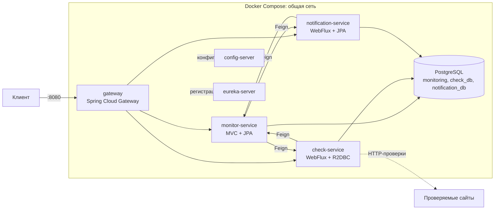
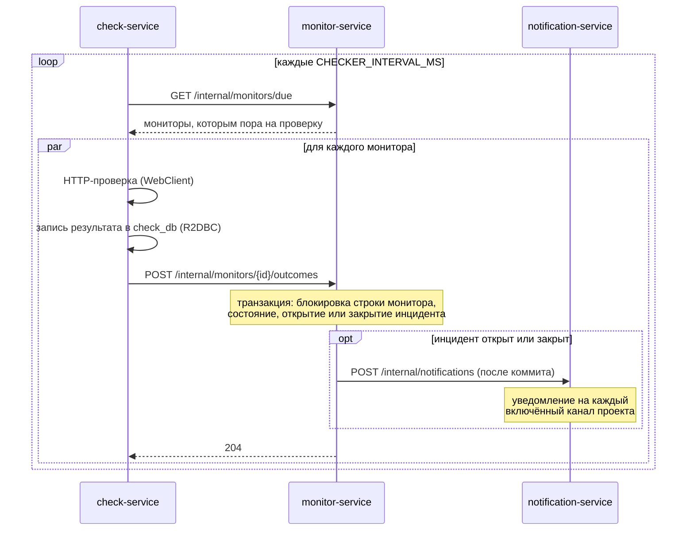
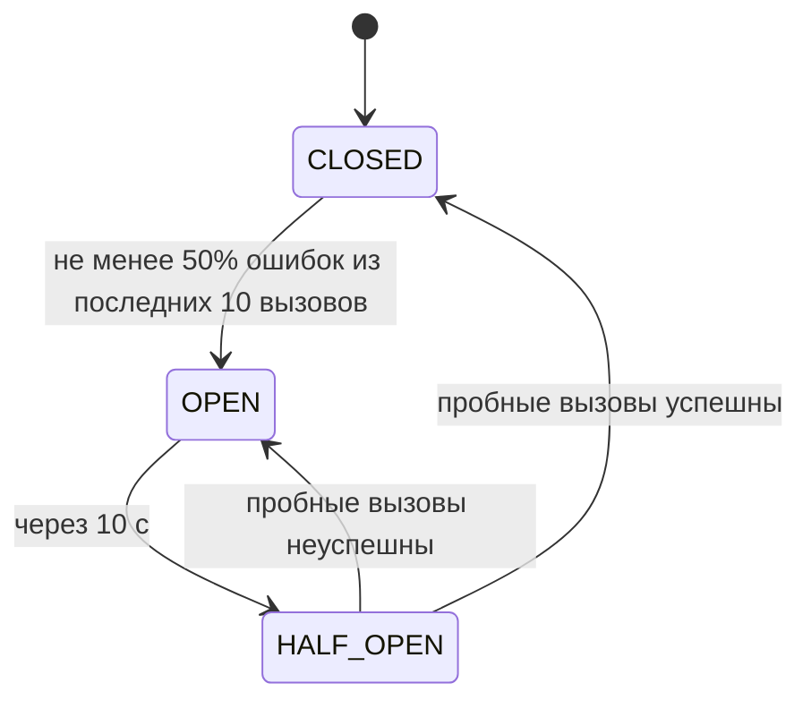

# Лабораторная работа №2. Декомпозиция на микросервисы

**Репозиторий:** https://github.com/awesoma31/service-monitoring

## 1. Задание

Разбить монолит из лабораторной работы №1 на микросервисы. Сервисы регистрируются в Eureka,
получают конфигурацию из Config Server и доступны через Spring Cloud Gateway. Сервисы
взаимодействуют через Feign Client, внедрён Circuit Breaker. Минимум один сервис написан на
Reactor и R2DBC, минимум один — на Reactor и Spring Data JPA/JDBC. Соответствие требований и
реализации — в разделе 10.

## 2. Архитектура

### 2.1. Развёртывание

Все компоненты запускаются одной командой `docker compose up` в одной docker-сети.
Контейнеры обращаются друг к другу по именам сервисов; на хост опубликованы gateway (API и
Swagger UI), панель Eureka и, для отладки, PostgreSQL. Бизнес-сервисы и Config Server
снаружи недоступны.



Порядок запуска задан проверками готовности: PostgreSQL → создание баз → config-server →
eureka-server → бизнес-сервисы → gateway.

### 2.2. Сервисы

| Сервис | Стек | Ответственность | Данные |
|---|---|---|---|
| monitor-service | Spring MVC, Spring Data JPA | пользователи, проекты, участники, мониторы, теги, инциденты | `monitoring` |
| check-service | Spring WebFlux, Spring Data R2DBC | планировщик, HTTP-проверки, история проверок | `check_db` |
| notification-service | Spring WebFlux, Spring Data JPA | каналы оповещения, уведомления | `notification_db` |
| config-server | Spring Cloud Config | конфигурация сервисов | — |
| eureka-server | Spring Cloud Netflix Eureka | реестр сервисов | — |
| gateway | Spring Cloud Gateway | маршрутизация, общий Swagger UI, Circuit Breaker | — |

### 2.3. Разделение данных

У каждого бизнес-сервиса своя база данных в общем контейнере PostgreSQL и свои миграции
Liquibase. Сервис работает только со своей базой; ссылки на сущности другого сервиса
хранятся как идентификаторы без внешних ключей (`check_results.monitor_id`,
`channels.project_id`, `notifications.incident_id`). Таблицы, перенесённые в другие
сервисы, удалены из базы monitor-service новыми наборами изменений 016 и 017 с описанным
откатом.

Согласованность данных между сервисами поддерживается вызовами: при удалении монитора или
проекта monitor-service просит check-service удалить историю проверок, а
notification-service — каналы проекта.

## 3. Взаимодействие сервисов

### 3.1. Цикл проверки



1. check-service запрашивает у monitor-service мониторы, которым пора на проверку, и
   проверяет их параллельно с ограничением числа одновременных проверок.
2. Результат сначала записывается в историю check-service, затем сообщается
   monitor-service. Если monitor-service недоступен, история остаётся полной, а состояние
   монитора обновит следующая проверка.
3. monitor-service в одной транзакции с блокировкой строки монитора
   (`SELECT ... FOR UPDATE`) меняет состояние и открывает или закрывает инцидент.
4. После коммита monitor-service сообщает notification-service об открытии или закрытии
   инцидента; тот создаёт уведомление для каждого включённого канала проекта.

### 3.2. Внутренние вызовы

Все межсервисные вызовы выполняются через Feign Client по имени сервиса; адрес экземпляра
определяется через Eureka. Внутренний API (`/internal/**`) gateway не маршрутизирует, и в
документации он скрыт.

| Кто → кому | Вызов | Назначение |
|---|---|---|
| check-service → monitor-service | `GET /internal/monitors/due` | мониторы для проверки |
| check-service → monitor-service | `POST /internal/monitors/{id}/outcomes` | результат проверки |
| check-service → monitor-service | `GET /internal/monitors/{id}/exists` | проверка монитора для запроса истории |
| notification-service → monitor-service | `GET /internal/projects/{id}/exists`, `/internal/incidents/{id}/exists` | проверка проекта и инцидента |
| monitor-service → notification-service | `POST /internal/notifications`, `DELETE /internal/projects/{id}/channels` | инцидент открыт или закрыт; проект удалён |
| monitor-service → check-service | `DELETE /internal/results?monitor_id=` | монитор удалён |

### 3.3. События после коммита

monitor-service не вызывает другие сервисы внутри транзакции. Изменения публикуются как
события приложения (`IncidentChanged`, `MonitorDeleted`, `ProjectDeleted`), а слушатель
`@TransactionalEventListener` вызывает другие сервисы только после успешного коммита.
Поэтому откатившаяся транзакция не порождает уведомлений, а недоступность
notification-service не отменяет открытие инцидента.

### 3.4. Транзакции после декомпозиции

Смена состояния монитора и открытие или закрытие инцидента по-прежнему атомарны: они
выполняются в одной транзакции monitor-service под блокировкой строки монитора. Запись
результата проверки (check-service) и создание уведомлений (notification-service) вынесены за
пределы этой транзакции, так как данные находятся в других базах. Возможное расхождение
ограничено: история проверок записывается раньше, чем результат сообщается, а надёжная
доставка уведомлений через брокер сообщений запланирована в лабораторной работе №4.

## 4. Инфраструктура

### 4.1. Eureka

Каждый сервис и gateway регистрируются в Eureka под своим именем приложения. Gateway
маршрутизирует по адресам вида `lb://monitor-service`, Feign-клиенты — по имени сервиса;
конкретный экземпляр выбирает Spring Cloud LoadBalancer. Интервалы обновления реестра и
кэша балансировщика уменьшены до 5 секунд, чтобы запущенный сервис становился доступен
через несколько секунд после старта.

### 4.2. Config Server

Config Server работает с профилем `native` и отдаёт файлы из каталога `config-repo`
модуля: `application.yml` содержит настройки, общие для всех сервисов (именование полей
JSON, Eureka, Circuit Breaker, actuator), а файл с именем сервиса — его собственные
(подключение к базе, планировщик, маршруты gateway). Сервис хранит у себя только имя и адрес
Config Server; значения секретов передаются переменными окружения. Тесты подключают те же
файлы напрямую, поэтому проверяют ту же конфигурацию, что используется при запуске.

### 4.3. Gateway

| Путь | Сервис |
|---|---|
| `/api/v1/monitors/*/results` | check-service |
| `/api/v1/projects/*/channels`, `/api/v1/channels/**`, `/api/v1/incidents/*/notifications` | notification-service |
| `/v3/api-docs/<сервис>` | документация сервиса |
| остальные `/api/v1/**` | monitor-service |

Gateway также публикует общий Swagger UI (`/swagger-ui.html`) со спецификациями всех
трёх сервисов. Gateway добавляет к запросам заголовки `X-Forwarded-*` (для адресов из
списка доверенных прокси — локального и частных сетей), а сервисы их учитывают. Поэтому в
спецификациях адресом сервера указан gateway, и запросы из Swagger UI проходят через него.

## 5. Отказоустойчивость

Circuit Breaker (Resilience4j) установлен на всех Feign-клиентах и на всех маршрутах gateway.



| Параметр | Значение |
|---|---|
| окно измерения | 10 последних вызовов, не менее 5 для оценки |
| порог ошибок | 50% |
| время в разомкнутом состоянии | 10 с |
| пробные вызовы | 2 |
| таймаут вызова | 3 с |

Поведение при недоступности сервиса (срабатывании fallback):

| Сервис-клиент | Недоступен | Поведение |
|---|---|---|
| check-service | monitor-service | проход проверок пропускается; результат, который не удалось сообщить, остаётся в истории; запрос истории отвечает 503 |
| notification-service | monitor-service | операции, требующие проверки проекта или инцидента, отвечают 503 |
| monitor-service | notification-service, check-service | вызов записывается в журнал; инцидент или удаление остаются в силе |
| gateway | любой сервис | ответ 503 в формате RFC 7807 с именем сервиса |

Проверка существования намеренно отвечает 503, а не 404: недоступность сервиса не означает,
что проект или монитор не существует.

Состояние автоматов доступно по `/actuator/circuitbreakers` каждого сервиса.

## 6. Реактивные сервисы

**check-service — Reactor и R2DBC.** Контроллеры и доступ к базе неблокирующие:
Spring WebFlux и Spring Data R2DBC. HTTP-проверки выполняются через `WebClient`, таймаут
монитора ограничивает весь обмен, включая соединение. История проверок читается
постранично без подсчёта строк: запрашивается на одну строку больше размера страницы, и
наличие этой строки означает, что есть продолжение. Миграции Liquibase выполняются по JDBC
до начала работы через R2DBC.

**notification-service — Reactor и Spring Data JPA.** Веб-слой реактивный, доступ к данным —
через блокирующий JPA. Каждое обращение к репозиториям выполняется в программной транзакции
на планировщике `Schedulers.boundedElastic()`, предназначенном для блокирующей работы, и
никогда не занимает поток обработки событий. Декларативный `@Transactional` здесь не
применяется, так как транзакция привязана к потоку, а реактивная цепочка переходит между
потоками.

Feign-клиенты блокирующие, поэтому в обоих сервисах их вызовы также выполняются на
`boundedElastic`.

## 7. Конфигурация и запуск

```bash
cp .env.example .env
docker compose up --build        # 8 контейнеров; API и Swagger — :8080, Eureka — :8761
./scripts/demo.sh                # сквозной сценарий через gateway
./scripts/circuit-breaker-demo.sh  # остановка notification-service и работа fallback
./gradlew check                  # тесты и контроль покрытия всех модулей
```

| Адрес | Назначение |
|---|---|
| `http://localhost:8080/api/v1/...` | API через gateway |
| `http://localhost:8080/swagger-ui.html` | общий Swagger UI |
| `http://localhost:8761` | панель Eureka |

## 8. Тестирование

| Модуль | Тестов | Покрытие строк |
|---|---|---|
| monitor-service | 102 | 96,9% |
| check-service | 22 | 90,2% |
| notification-service | 16 | 96,7% |
| gateway | 5 | 90,9% |
| config-server | 4 | — |
| eureka-server | 1 | — |

Для каждого бизнес-модуля задача `check` завершается ошибкой при покрытии строк ниже 70%.
Интеграционные тесты используют Testcontainers (PostgreSQL); другие сервисы заменяются
заглушками Feign-клиентов. Отдельные тесты проверяют Circuit Breaker с настоящим
Feign-клиентом при недоступном сервисе: срабатывание fallback, ответ 503 и переход автомата в
состояние `OPEN`; а также маршруты gateway, их fallback и состав общего Swagger UI.

## 9. Изменения относительно лабораторной работы №1

- Монолит перенесён в модуль monitor-service без изменения логики; планировщик, история
  проверок, каналы и уведомления выделены в отдельные сервисы.
- Транзакция открытия и закрытия инцидента и тесты блокировки строки монитора сохранены в
  monitor-service.
- Внешний API не изменился: те же пути `/api/v1/...` доступны через gateway.

## 10. Соответствие требованиям

| Требование | Реализация |
|---|---|
| Декомпозиция на микросервисы | раздел 2: monitor-service, check-service, notification-service |
| Регистрация в Eureka | eureka-server; все сервисы и gateway — клиенты Eureka |
| Конфигурация из Config Server | config-server, профиль `native`, раздел 4.2 |
| Доступ через Spring Cloud Gateway | gateway, раздел 4.3 |
| Взаимодействие через Feign Client | раздел 3.2 |
| Circuit Breaker | Resilience4j, раздел 5 |
| Сервис на Reactor и R2DBC | check-service, раздел 6 |
| Сервис на Reactor и Spring Data JPA | notification-service, раздел 6 |
